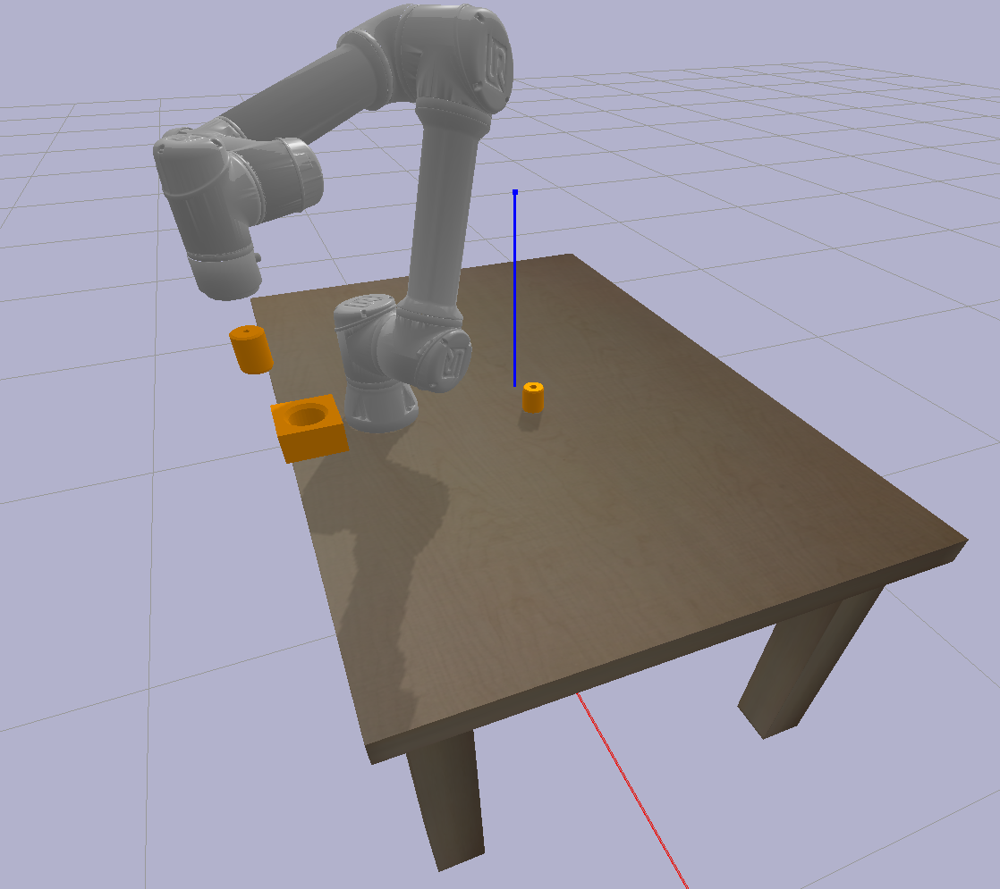

# itmobotics sim
IT's MOre than a roBOTICS SIMulator - The framework for simulating open loop kinematic robots in the best traditions of sim2real concept. 



## Installation
For installing package run in package directory:
```bash
    pip3 install .
```

Installation completed if pip show your package:
 ```bash
    pip3 show itmobotics-sim
```
